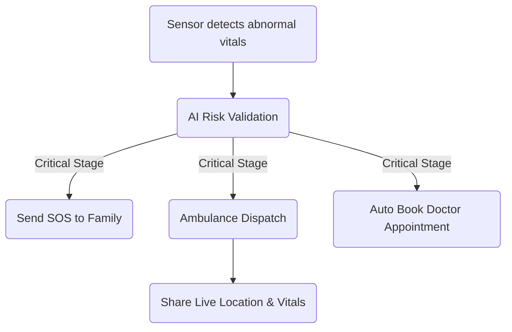

# MediSense AI - Remote Health Monitoring with Smart IoT Ring

## 💡 Inspiration
In today’s fast-paced world, many patients, especially seniors and those with chronic conditions, lack continuous monitoring, leading to late detection and delayed care. We wanted to build a solution that offers **24/7 health tracking, predictive risk detection, and emergency response**, ensuring help arrives before it’s too late.

---

## 🚀 What It Does
MediSense AI is a **smart health monitoring system** that uses **AI and IoT-enabled smart rings** to monitor vital signals in real-time, such as:
- Heart Rate & HRV
- SpO₂ (Blood Oxygen)
- Body Temperature
- ECG for cardiac patterns
- Fall detection & motion monitoring

🔔 It automatically:
✔ Detects emergency conditions  
✔ Sends SOS alerts to family members  
✔ Dispatches ambulance service with GPS location  
✔ Books doctor appointments instantly  
✔ Shares vitals and health history with medical professionals  

An AI chatbot assists with health guidance, reports, medication reminders, and vital interpretation.

---

## 🛠 How We Built It
**Hardware:**
- Smart ring with PPG, ECG, Temperature, and motion sensors  
- Bluetooth connectivity to smartphone  

**Software & AI:**
- Mobile App for live health dashboard  
- Cloud-based storage & processing (Firebase/AWS)  
- Machine Learning models for anomaly detection  
- AI Chatbot (LLM) for assistant interactions  
- Emergency alert API with GPS tracking  

---

## 📡 Emergency Response Workflow

---

## ⚠ Challenges We Faced
| Challenge | How We Overcame |
|-----------|------------------|
| Achieving accurate vitals | Calibrated sensors using ML filtering |
| Real-time data sync | Implemented cloud-based data pipeline |
| Instant SOS alerting | Built multi-channel notification (SMS, App, Call) |
| HIPAA health privacy | Used AES encryption for secure data |
| Emergency API integration | Used location-based hospital selection |

---

## 🏆 Accomplishments
✨ Built functional real-time health tracking  
✨ Successfully tested SOS auto-alert and appointment scheduling  
✨ Integrated AI chatbot for interactive health support  
✨ Created a scalable IoT-AI health architecture  

---

## 📚 What We Learned
🧠 Sensor calibration & ML-driven anomaly detection  
🔐 Importance of data privacy & encryption  
⚙ Designing real-time emergency alert systems  
💬 Building AI chatbots for health assistance  

---

## 🔮 What's Next for MediSense AI
🚀 Insurance claim automation  
🚀 Voice & gesture-based SOS trigger  
🚀 Integration with hospital EMR systems  
🚀 Elder care & remote patient monitoring at scale  

---

✨ *MediSense AI — Because Every Second Can Save a Life.*
